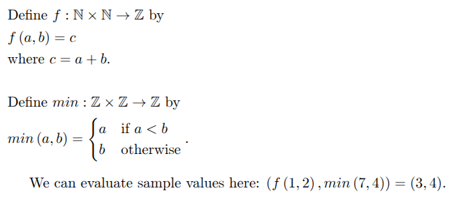
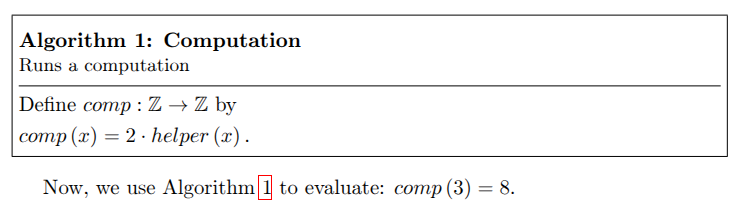

# nothing-but-math

[](https://doi.org/10.5281/zenodo.20827013)

Nothing But Math (NBM) is a Domain-Specific Language for writing scientific text and algorithms in a single source file. From that source, the compiler generates two synchronized outputs:

- a LaTeX document where algorithms are rendered in formal mathematical notation, and
- a Haskell library that contains runnable implementations of the same algorithms.

The project was designed for the [research paper](https://github.com/niek-peters/nbm-paper-source) that accompanies this repository. Its goal is to make mathematical algorithm descriptions easier to write, easier to read, and easier to reproduce.

## Table of Contents

- [What NBM does](#what-nbm-does)
- [Installation](#installation)
- [Requirements](#requirements)
- [Usage](#usage)
- [Language overview](#language-overview)
- [Project structure](#project-structure)
- [Running tests](#running-tests)
- [Implementation notes](#implementation-notes)
- [Parser grammar](#parser-grammar)
- [Related paper](#related-paper)
- [Future work](#future-work)

## What NBM does

NBM lets you interleave three kinds of content in one `.nbm` file:

- text sections, which are passed through as LaTeX,
- code sections, which define functions and constants, and
- eval sections, which run expressions and insert their results into the generated LaTeX.

The compiler then produces:

- a `.hs` file containing the generated Haskell module,
- a `.tex` file containing the generated LaTeX document, and
- optionally a PDF (this requires `pdflatex` to be available in `PATH`).

## Installation

### From source

Build and install the executable using Stack:

```bash
stack install
```

### From a release

Prebuilt binaries are published on the GitHub releases page:

https://github.com/niek-peters/nothing-but-math/releases

Download the release for your platform and add the `nbm` executable to your `PATH`.

## Dependencies

The compiler itself is a Haskell application. For day-to-day use, the external tools you need depend on the features you use:

| Feature                                | Extra requirement                    |
| -------------------------------------- | ------------------------------------ |
| Plain compilation to Haskell and LaTeX | none beyond the NBM executable       |
| Eval sections                          | `ghc` in `PATH`                      |
| `--pdf`                                | a LaTeX distribution with `pdflatex` |

If your source file uses eval sections and you also want PDF generation, you need both `ghc` in `PATH` and a LaTeX distribution.

The repository contains Dockerfiles under `test/DependencyTesting/` that show the minimal dependency sets for these cases.

## Usage

The CLI entry point is `nbm`.

```bash
nbm PATHNAME [--out-dir DIR] [--module-name MODULE_NAME] [--wrapdoc] [--pdf]
```

### CLI options

| Option                            | Meaning                                                                                                                  |
| --------------------------------- | ------------------------------------------------------------------------------------------------------------------------ |
| `PATHNAME`                        | Path to the `.nbm` file. If the extension is omitted and the file does not already exist, `.nbm` is added automatically. |
| `-o`, `--out-dir DIR`             | Output directory for generated files. Defaults to the current directory.                                                 |
| `-m`, `--module-name MODULE_NAME` | Name of the generated Haskell module. Defaults to `NBM`.                                                                 |
| `-w`, `--wrapdoc`                 | Wrap the generated LaTeX in a minimal document preamble. Use this when you are not already supplying a LaTeX template.   |
| `-p`, `--pdf`                     | Run `pdflatex` after generation and produce a PDF.                                                                       |
| `-v`, `--version`                 | Print the compiler version.                                                                                              |

### Typical workflows

Generate Haskell and LaTeX only:

```bash
nbm test/samples/functions.nbm -o out
```

Generate LaTeX plus a standalone PDF:

```bash
nbm test/samples/functions.nbm -o out -w -p
```

Change the generated Haskell module name:

```bash
nbm test/samples/booleans.nbm -o out -m MyNBM
```

## Language overview

An NBM source file is split into fragments by special delimiters:

- `<<< ... >>>` for code sections,
- `{{{ ... }}}` for eval sections, and
- everything else for text sections.

Text sections are emitted as-is, so you can write ordinary LaTeX there. Code and eval sections use the DSL syntax described below.

### Example source

```
<<<
f : N x N -> Z
f(a, b) := c
where c := a + b

min : Z x Z -> Z
min(a, b) := {
    a   if a < b
    b   otherwise
}
>>>

We can evaluate sample values here: {{{(f(1, 2), min(7, 4))}}}.
```

Rendered LaTeX output:



### Definitions

A definition has four parts:

1. optional annotations,
2. a name,
3. a type signature, and
4. an implementation, optionally followed by a `where` clause.

Constants are just definitions without arguments:

```
pi : R
pi := 3.1415926535
```

Functions use one or more arguments:

```
g : Z x N -> Q
g(x, a) := x ^ a / 2
```

### Constraints and local declarations

The `where` clause can contain two kinds of entries:

- constraints, which must evaluate to `True`, and
- local declarations, which introduce reusable intermediate values.

Examples:

```
f : Z -> Q
f(x) := 1 / c
where c := x + 1, c /= 0
```

Constraints are checked before the implementation runs. If a constraint fails, the generated Haskell code raises a runtime error instead of continuing.

### Piecewise functions

Conditional implementations are written with braces:

```
abs : Z -> N
abs(x) := {
    -x if x < 0
    x  otherwise
}
```

### Types

NBM supports the following primitive types:

| NBM type | Meaning           |
| -------- | ----------------- |
| `Z+`     | positive integers |
| `N`      | natural numbers   |
| `Z`      | integers          |
| `Q`      | rational numbers  |
| `R`      | real numbers      |
| `B`      | booleans          |

Tuples are written with `x` between types, for example `Z x N -> Q` or `Z x R`.

### Operators

The parser supports the following operators:

| Category   | Operators                       |
| ---------- | ------------------------------- |
| Unary      | `-`, `sqrt`, `floor`            |
| Arithmetic | `+`, `-`, `*`, `/`, `^`, `mod`  |
| Relational | `\|`                            |
| Comparison | `=`, `/=`, `<`, `<=`, `>`, `>=` |
| Boolean    | `not`, `and`, `or`              |

The `|` operator denotes divisibility.

### LaTeX annotations

Annotations let you control how code sections are rendered in the output document.

Section-level annotations use `#[...]` and apply to the entire code section. Inside the square brackets, annotations are written as a comma-separated list of tags and key-value pairs.

Supported section-level annotations are:

- `#[inline]` - render the section inline,
- `#[intext]` - render the section as a multi-line in-text display,
- `#[box]` - render the section inside a framed definition box,
- `#[hidden]` - omit the section from the LaTeX output,

Definition-level annotations use `@[...]` and currently support:

- `@[hidden]` - omit a single definition from the LaTeX output.

The `#[box]` annotation can also take specific metadata:

- `class="..."` - set the box class name,
- `name="..."` - set the box title,
- `label="..."` - set the LaTeX label,
- `description="..."` - add a short description under the title.

Example:

```
<<<
#[box, class="Algorithm", name="Computation", label="alg:computation", description="Runs a computation"]
@[hidden]
helper : Z -> Z
helper(x) := x + 1

comp : Z -> Z
comp(x) := 2 * helper(x)
>>>
Now, we use Algorithm~\ref{alg:computation} to evaluate: {{{comp(3)}}}.
```

Rendered LaTeX output:



## Project structure

- `app/` - command-line entry point.
- `src/` - lexer, parser, elaboration, evaluation, and code generation.
- `prelude/` - helper code injected into the generated Haskell module.
- `test/` - Hspec and golden tests.
- `test/samples/` - sample `.nbm` programs used by the tests.
- `test/DependencyTesting/` - Dockerfiles and NBM source files for feature-specific dependency checks.
- `build.sh` - build script.

## Running tests

Run the test suite with Stack:

```bash
stack test
```

The test suite employs the _golden testing_ strategy to test every phase of the compilation pipeline.
The expected outputs of these tests can be found in the `test/samples/results` directory.

Additionally, compilation phases that should throw errors given certain source code are tested with _unhappy path testing_
in the individual compilation phase test specification files (e.g., `test/Eval/EvalSpec.hs`, `test/Elab/ElabSpec.hs`, etc.).

## Implementation notes

The compiler pipeline follows the structure described in the paper:

1. tokenize the source file,
2. parse code and eval sections into ASTs,
3. elaborate the definitions to resolve names and insert casts,
4. generate a Haskell library,
5. evaluate eval sections against the generated library, and
6. generate the final LaTeX document with the text, definitions, and evaluated results.

The generated Haskell code includes a prelude with a custom positive integer type and runtime casting helpers.

## Parser grammar

The full grammar reference is kept in [docs/language-grammar.md](docs/language-grammar.md).

## Related paper

The repository implements the prototype described in the accompanying research paper
"Bridging the Gap between Mathematics and Programming via a Dual-Target DSL for LaTeX and Haskell" by Niek Peters. For more information on the design of NBM, the source code of the paper can be found [here](https://github.com/niek-peters/nbm-paper-source).

## Future work

Some parts of the implementation have been delegated to Future Work. Descriptions are given in comments starting with "Future Work".
